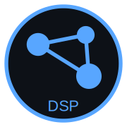

# Drug Similarity Pipeline  
### *2D/3D Molecular Similarity Engine using RDKit, ChEMBL, PubChem*

---

# Drug Similarity Pipeline  
**Chemical Similarity with Biological Context (ChEMBL + Reactome)**

An open-source backend pipeline for **drug similarity analysis enriched with biological pathway information**.

This project goes beyond pure chemical similarity by integrating **targets, proteins, and curated biological pathways**, enabling more interpretable and biologically meaningful similarity results.

---

## Motivation

Most drug similarity tools focus solely on molecular structure:

> *“These two compounds look similar.”*

However, in real-world drug analysis, a more relevant question is:

> **Do similar drugs also act on similar biological pathways?**

This project addresses that gap by combining:
- molecular similarity (2D & 3D)
- drug–target relationships
- protein-level mappings
- pathway-level biological context

---

## Conceptual Model

The core biological chain implemented in this pipeline is:
Drug → Target → Protein (UniProt) → Pathway (Reactome)

This allows similarity results to be interpreted not only chemically, but also **biologically**, which is especially useful for:
- drug mechanism analysis
- hypothesis generation
- exploratory drug repurposing studies

---

## Key Features

- **Approved drug ingestion** from ChEMBL (local cache)
- **Target and protein mapping** (many-to-many relationships)
- **Reactome pathway integration** via UniProt IDs
- **2D and 3D molecular similarity computation**
- **Pathway-aware drug profiling**
- Fully **API-driven backend**
- Designed for **local, reproducible data storage**

---

## Architecture Overview

The system is organized as a set of decoupled services:

- **ChEMBL Drug Sync**
  - Approved drugs
  - Canonical SMILES

- **Target & Protein Sync**
  - Drug ↔ Target
  - Target ↔ Protein (UniProt)

- **Reactome Pathway Sync**
  - Protein ↔ Pathway

- **Similarity Engine**
  - Chemical similarity (2D/3D)
  - Biological context enrichment

Each synchronization step is:
- idempotent
- resumable
- independently executable

This design allows robust operation even when external APIs are temporarily unavailable.

---

## Intended Use Cases

- Backend service for drug similarity APIs
- Research pipelines requiring biological interpretation
- Educational or exploratory bioinformatics projects
- Foundation for extending toward:
  - pathway similarity scoring
  - mechanism-of-action clustering
  - drug repurposing analysis

> **Note:**  
> This project focuses on data pipelines and APIs, not UI or visualization.

---

## Technology Stack

- **Python**
- **FastAPI**
- **SQLAlchemy**
- **ChEMBL WebResource Client**
- **Reactome Content Service**
- **MariaDB / MySQL**
- **Docker-ready architecture**

The stack is intentionally simple and extensible.

---

## Open Source & Extensibility

This project is open source and designed to be extended.

Possible future extensions include:
- KEGG or WikiPathways integration
- UniProt annotation enrichment
- Pathway-level similarity metrics
- Disease or indication mapping

Contributions, feedback, and discussions are welcome.

---

## Getting Started

Basic workflow:

1. Sync approved drugs from ChEMBL
2. Sync drug targets and protein mappings
3. Sync Reactome pathways
4. Run similarity queries enriched with pathway data

Each step is exposed via a dedicated API endpoint.

Refer to the source code for service-level details.

---

## License

This project is released under an open-source license  
(see LICENSE file for details).

---

## Author

Developed by **Omid Milanifard**  
with a focus on scientific software design, data engineering,  
and biologically interpretable drug analysis.

---

## Repository

https://github.com/milanifard/drug-similarity-pipeline

